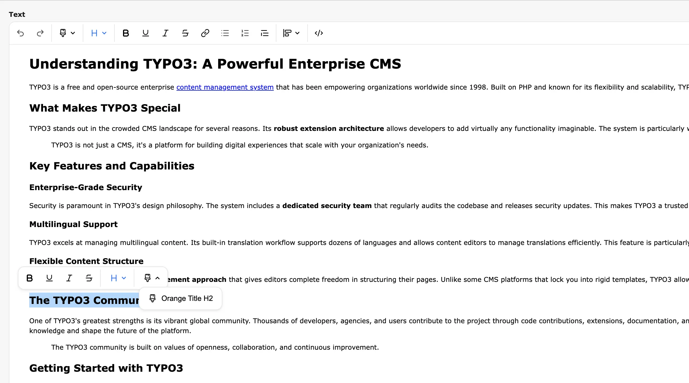

# TYPO3 TipTap Editor (Beta)

This extension provides a modern TipTap rich text editor integration for TYPO3 CMS.

The development of this extension was funded by the [TYPO3 Association](https://typo3.org) through the [Community Ideas program](https://typo3.org/article/members-have-selected-five-ideas-to-be-funded-in-quarter-3-2025).

> **Note:** This is an MVP prototype suitable for testing purposes. It is not yet ready for production use.




---

## Quick Start Guide

Install the extension via Composer:

```bash
composer require in2code/in2tiptap
```

You don't have to remove the CkEditor extension; both editors can coexist.

The editor comes with a **default configuration** that works out of the box. You can start using it immediately without any additional setup.

### Optional: Customize the Configuration

If you want to customize the editor to your specific needs, you can overwrite the default configuration:

1. Copy the [example YAML configuration file](Configuration/RTE/Full.yaml) to your site package
2. Customize it according to your requirements
3. Register your custom preset in TYPO3:

```php
// Setup custom editor configuration
$GLOBALS['TYPO3_CONF_VARS']['RTE']['Presets']['default'] = 'EXT:sitepackage/Configuration/RTE/TipTap.yaml';
```

---

## Configuration

### Understanding the Architecture

TipTap uses a plugin-based architecture where functionality is added through plugins. Like CKEditor, TipTap is configured using YAML files placed in your site package at `Configuration/RTE/`.

The extension ships with a default configuration that includes commonly used features. You only need to create a custom configuration if you want to modify the toolbar, add custom plugins, or adjust the editor behavior.

### Configuring the Toolbar

Each plugin can have its own configuration options that are validated in the frontend. Below is a complete example showing all available plugins. You can enable or disable any plugin by adding or removing its entry:

```yaml
editor:
  tiptap:
    config:
      plugins:
        - path: '@in2tiptap/tiptap/plugins/headings.js'
          config:
            levels: [ 1, 2, 3, 4, 5, 6 ]
        - path: '@in2tiptap/tiptap/plugins/history.js'
          config:
            types: [ "undo", "redo" ]
        - path: '@in2tiptap/tiptap/plugins/bold.js'
        - path: '@in2tiptap/tiptap/plugins/underline.js'
        - path: '@in2tiptap/tiptap/plugins/italic.js'
        - path: '@in2tiptap/tiptap/plugins/strikethrough.js'
        - path: '@in2tiptap/tiptap/plugins/link.js'
        - path: '@in2tiptap/tiptap/plugins/list.js'
          config:
            types: [ "ordered", "bullet" ]
        - path: '@in2tiptap/tiptap/plugins/blockquote.js'
        - path: '@in2tiptap/tiptap/plugins/justify.js'
          config:
            types: [ "justify-left", "justify-center", "justify-right" ]
        - path: '@in2tiptap/tiptap/plugins/source.js'
        - path: '@in2tiptap/tiptap/plugins/styles.js'
          config:
            styles:
              - { name: "Orange title H2", element: "h2", classes: "orange" }
              - { name: "Orange title H3", element: "h3", classes: "orange" }
              - { name: "Paragraph Blue", element: "p", classes: "paragraph-blue" }
              - { name: "Link Green", element: "a", classes: "link-green" }
```

### Loading Custom CSS

You can load additional CSS files for the editor content using the `contentCss` option:

```yaml
editor:
  tiptap:
    config:
      contentCss:
        - 'EXT:sitepackage/Resources/Public/Css/content.css'
```

---

## Creating Custom Plugins

You can extend TipTap with custom plugins by creating JavaScript files in your site package and referencing them in your RTE configuration.

### Step 1: Register Your Plugin

Add your plugin to the RTE YAML configuration:

```yaml
editor:
  tiptap:
    config:
      plugins:
        - path: '@example/in2code/Plugins/example.js'
          config: # Optional plugin configuration
            additionalClass: "my-example-class"
```

### Step 2: Create the Plugin File

Create your plugin JavaScript file. Configuration is optional—if you don't need it, simply remove the `unsafeConfig` and `parseTipTapPluginYamlConfiguration` parts.

```js
import {
    defineTipTapPlugin,
    parseTipTapPluginYamlConfiguration,
} from '@in2tiptap/tiptap/index.js'

export default function (unsafeConfig) {
  // Parse plugin configuration from YAML to ensure it matches expectations
  // Configuration parsing uses Zod validation. Learn more: https://zod.dev/
  const config = parseTipTapPluginYamlConfiguration({
    pluginId: 'cookie',
    config: unsafeConfig,
    getValidationSchema: z => z.object({
      additionalClass: z.string(), // requires additionalClass to be provided and be a string
    }),
  })

  defineTipTapPlugin({
    // Optional: Add custom TipTap extensions here if needed
    extensions: [],

    // Commands define buttons added to the toolbar or bubble menu
    commands: [
      {
        id: 'cookie',
        label: 'Add cookie',
        iconIdentifier: 'icon-cookie',
        position: {
          // Valid toolbar group IDs: history, styles, heading, general, formatting, developer
          toolbarGroupId: 'general',
          // Valid bubble menu group IDs: formatting, heading, styles
          // Set to false to disable button in bubble menu or toolbar
          bubbleMenuGroupId: false,
        },
        // Optional status functions to control button state
        status: {
          isActive: ({ editor }) => editor.isActive({ textAlign: 'right' }),
          isDisabled: ({ editor }) => !editor.can().setTextAlign('right'),
        },
        // This function executes when the button is clicked
        // Add your TipTap logic here
        onExecute: ({ editor }) => {
          editor.commands.setCookieButton({
            text: 'Accept Cookies',
            class: config.additionalClass
          })
        },
      },
    ],
  })
}
```

### Learning by Example

The plugin structure may seem abstract at first. We recommend reviewing the [existing plugins](frontend/src/plugins) in the source code and using them as templates for your own implementations.

---

## Local Development

For instructions on setting up the project for local development, please refer to the [Local Setup Documentation](docs/local-setup.md).

---

## Support & Contribution

Feedback, bug reports, and contributions are welcome!
